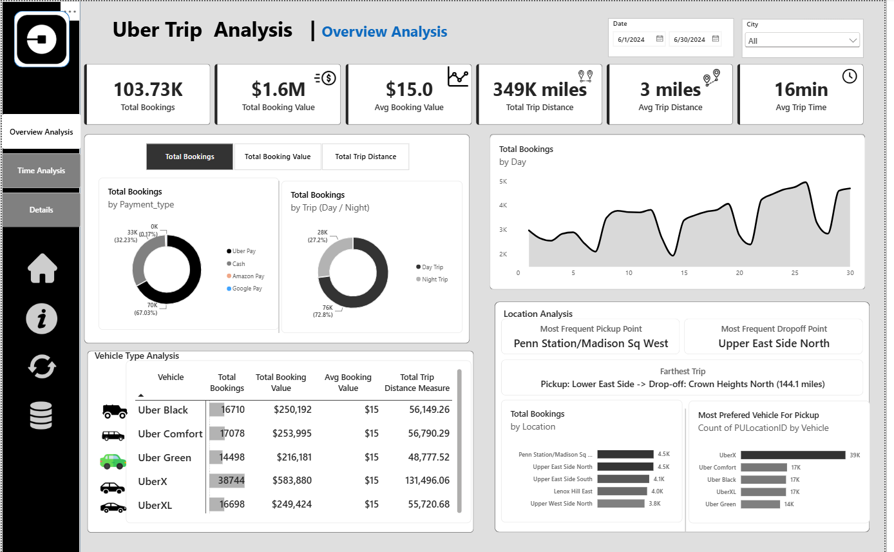
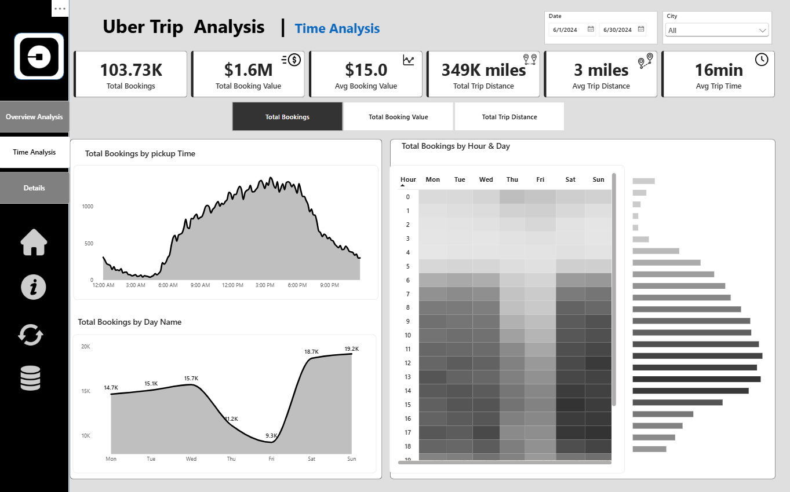
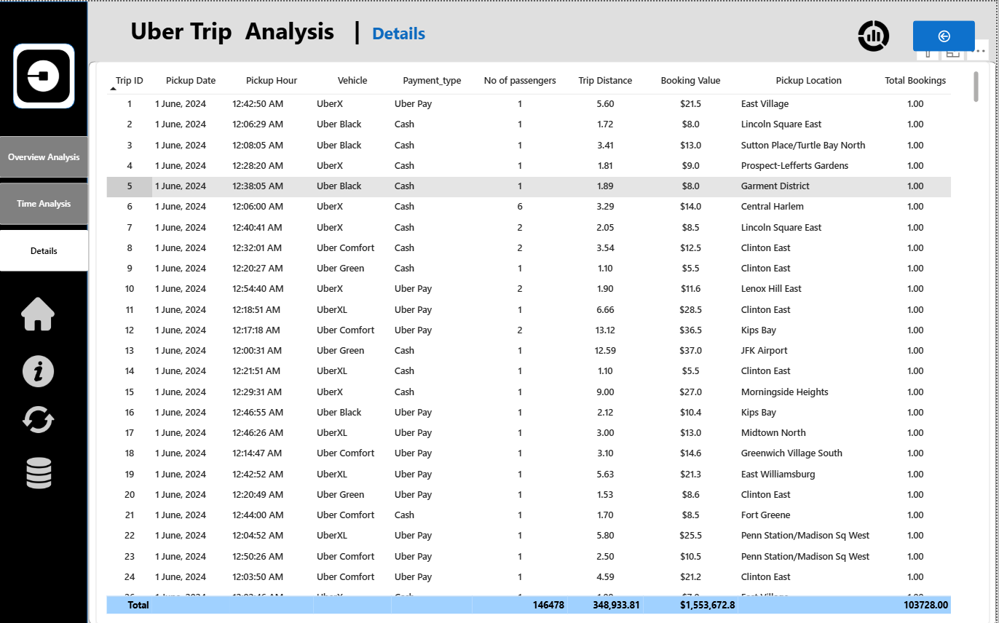

# Uber-Trip-Analysis – Power BI Dashboard

## Project Overview

This project presents an interactive Power BI dashboard for analyzing Uber ride booking data.

The dashboard provides insights into booking performance, ride trends, vehicle types, cancellations, revenue, customer behavior, and time-based patterns.

The objective of this project is to transform raw ride-booking data into meaningful business insights using data analysis and visualization.

---

## Tools & Technologies

- Power BI
- Power Query
- DAX
- Data Cleaning
- Data Visualization
- Excel/CSV Dataset

---

## Dashboard Pages

### 1. Overview Analysis

The Overview Analysis page provides a high-level summary of the Uber booking data.

Key elements include:

- Total booking KPIs
- Booking status analysis
- Vehicle type analysis
- Revenue-related metrics
- Ride distance analysis
- Customer and driver ratings
- Interactive filters and slicers

### 2. Time Analysis

The Time Analysis page focuses on understanding booking trends over time.

It helps analyze:

- Booking trends
- Time-based patterns
- Revenue trends
- Ride activity
- Performance across different periods

### 3. Details

The Details page provides a more granular view of the underlying booking information.

Users can use filters and interact with the data to investigate individual records and booking-level details.

---

## Key Analysis Areas

The dashboard focuses on:

- Booking performance
- Successful and cancelled bookings
- Vehicle type performance
- Ride distance
- Booking value
- Customer ratings
- Driver ratings
- Time-based booking trends
- Customer and driver behavior

---

## Dashboard Preview

### Overview Analysis


### Time Analysis


### Details


---

## Project Structure

```text
Uber-Ride-Booking-Analysis-PowerBI/
│
├── README.md
│
├── PowerBI/
│   └── Uber_Ride_Booking_Dashboard.pbix
│
├── Dataset/
│   └── uber_ride_booking_data.csv
│
├── Screenshots/
│   ├── overview-analysis.png
│   ├── time-analysis.png
│   └── details.png
│
└── Documentation/
    └── project-notes.md


Jaana Himanth
